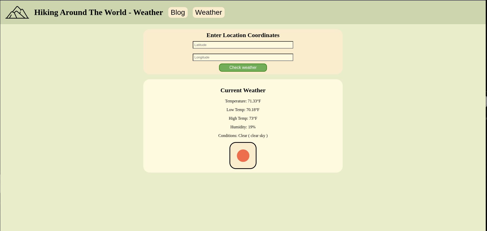

# CS-312-MiniProject-2

### Overview
Adding on to the basic blog web application using NodeJS, ExpressJS, EJS, and axios.
- Added [OpenWeather API](https://openweathermap.org/current) to the website showcasing API integration, client-server communication, and user-friendly data presentation using EJS.

### Installation

1. Clone the repository:
```git clone https://github.com/aidengseay/CS-312-MiniProject-2.git```

2. Install dependencies
```npm install```

3. Create a `config.env` file to hold OpenWeatherMap API key
```OPEN_WEATHER_KEY={your_openweathermap_api_key}```

4. Run the server
```node index.js```

5. Go to the following below on your browser
`http://localhost:3000`

### Preview


<p align="center" ><em>Weather Page</em></p>


### Sources

- [Dotenv NPM Package](https://www.npmjs.com/package/dotenv)

- [Horizontal Nav Bar](https://www.w3schools.com/css/css_navbar_horizontal.asp)

- [Flexbox for Nav Bar](https://www.w3schools.com/css/css3_flexbox.asp)

- [Throw Error Handling](https://developer.mozilla.org/en-US/docs/Web/JavaScript/Reference/Statements/throw)

- [w3schools: For general documentation (JS, HTML, CSS)](https://www.w3schools.com/)

- [Button Generator from Udemy demo](https://www.bestcssbuttongenerator.com/)

- <a href="https://www.flaticon.com/free-icons/mountain" title="mountain icons">Mountain icon created by Freepik - Flaticon</a>